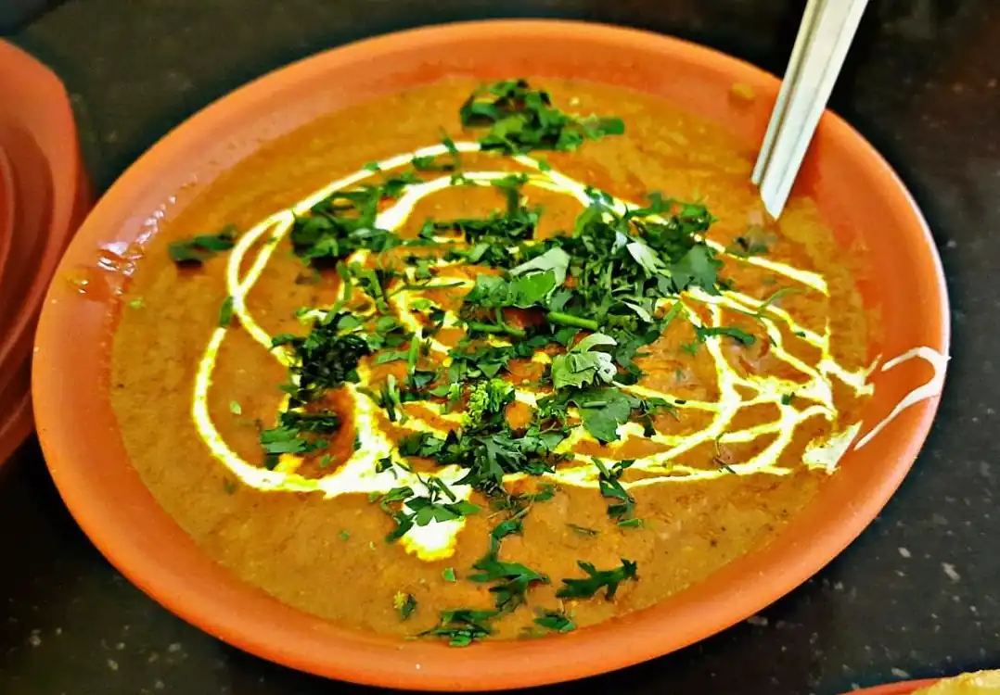

# Butter Chicken Masala Curry

Butter chicken Masala is one of India's most popular chicken recipes, a mild curry with a tomato-onion-cream base and boneless chicken pieces cooked in it to perfection.

- ⏲️ Prep time: 30 min
- 🍳 Cook time: 30 min
- 🍽️ Servings: 2

## Ingredients

- Boneless Chicken 1/2lb, cubed
- Butter Melted 2 tbsp
- Onions 2 medium-sized, minced
- Tomato 2 medium-sized, pureed
- Oil 2 tbsp
- Lemon juice 1 tbsp
- Garlic cloves 3, minced/crushed
- Ginger 1tbsp, minced/paste
- [Garam Masala](garam-masala.html)/Chicken Masala 1 tbsp
- Cream 4tbsp (or cashew paste)
- Chilli Powder 1 tbsp
- Turmeric powder 1/4 tbsp
- Crushed fenugreek leaves 1/4 tbsp
- 1 small bunch of coriander leaves / cilantro, for ganish

## Directions

1. In a bowl, mix chicken with salt, pepper, 1/2 tbsp ginger-garlic paste, 1/2 tbsp chili powder, turmeric powder, and lemon juice for the chicken marinade; let marinate for an hour.
2. Roast the marinated chicken in an oven at medium temperature for 5 to 10 minutes. The chicken should be three-fourths done.
3. Heat butter in a pan. Fry the onions until it turns translucent.
4. Add garlic-ginger and sauté for a minute, then add garam masala. Cook for a few seconds making sure not to burn the paste.
5. Add tomato puree, salt, and chili powder. Let simmer for about 5 minutes, occasionally stirring until sauce thickens and becomes a deep brown-red color.
6. Add the marinated chicken, butter, fresh cream, the crushed fenugreek leaves, and sliced green chilies. Cook for an additional 5 to 10 min until the chicken is cooked.
7. Adjust salt, garnish with the coriander leaves. Serve over rice or naan.

## Contribution

- Nihar Samantaray - [website](https://nihars.com), [contact](mailto:i@nihars.com)

;tags: indian curry chicken
