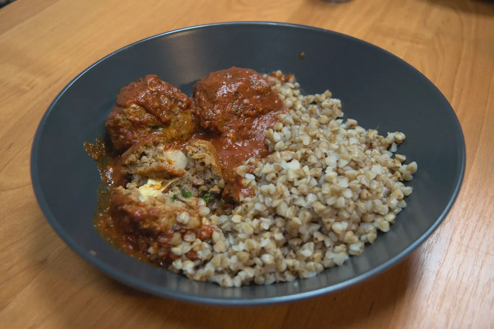

# Cheesy Meatballs with Tomato Sauce

Nothing beats meat, cheese and tomato combined together to create the best
combination of flavors that man has created.

## Ingredients

The quantities here are for about two adult portions. That is, if you are also
making some side dish, like in the photo.

For the meatballs:

* 300-400g of ground beef meat
* 1/4 of an onion
* ~70g of cheese; I have made with different cheese types, but usually I use
  Gouda
* Parsley
* 1-2 garlic cloves
* 1 egg
* ~1/5 metric cups (~50ml) of bread crumbs

For the sauce:

* 250ml of water
* 8 spoonfuls of tomato paste
* Oregano
* Basil
* Black pepper

## Directions

1. Beat the egg(s) in a large bowl.
2. Add in the ground beef, and the bread crumbs and mix.
3. Chop the onion into small pieces and add it to the bowl.
4. Mince the garlic cloves and add to the bowl.
5. Dice the parsley leaves and add to the bowl.
6. Salt the beef mix and mix it thoroughly.
7. Cut the cheese into cubes. The amount of cubes you will need will depend on
   how many meatballs you make, which depends on how big you want to make the
   meatballs. You get the idea.
8. Take a cheese cube and wrap with enough ground meat to completely cover it.
   Repeat this process until you've run out of the ground beef mix.
9. Heat the frying pan, add some olive oil, and add the meatballs. Cook over
   medium heat rolling the meatballs from time to time until they are slightly
   brown from all sides (wait, spheres have no sides).
10. When the meatballs look done, pour the water and tomato paste; add the dried
    oregano and basil, and ground black pepper; and salt to taste.
11. Cook over medium-low heat for about ten minutes rolling the meatballs so
    that they get completely bathed in tomato sauce.
12. Serve with some side dish and enjoy!

Originally published at [https://www.yaroslavps.com/food/cheesy-meatballs/](https://www.yaroslavps.com/food/cheesy-meatballs/)

## Contribution

- Yaroslav de la Peña Smirnov -- [website](https://www.yaroslavps.com/), 
[other website](https://saucesource.cc/),
[donate](https://www.yaroslavps.com/donate)

;tags: beef cheese
