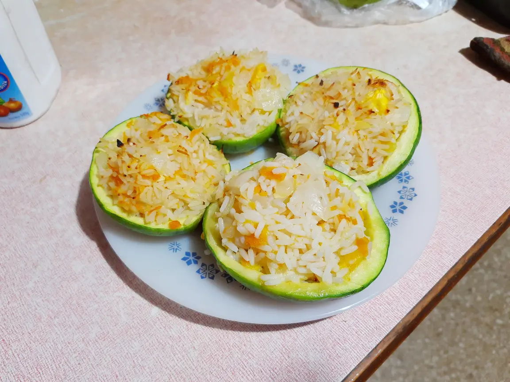
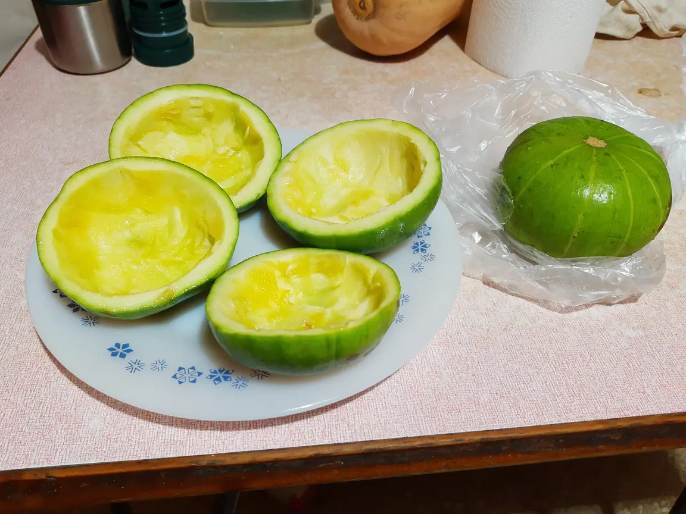
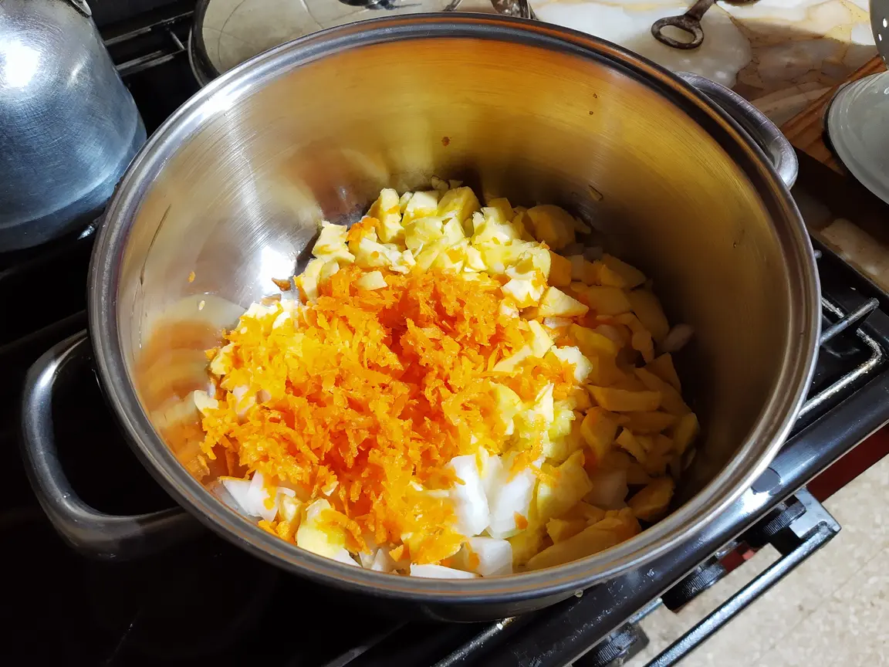

# Stuffed Round Squash

Round Squash, Zucchini, or Courguettes can be served as main dish (2 servings per person) or as accompaniment. The amount of squash should be adjusted according to their size. This recipe uses ones the size of a fist.

- ⏲️ Prep time: 50 min
- 🍽️ Servings: 4

## Ingredients

- 2 Onions
- 1 Carrot
- 4 Round squash
- 1 Cup of rice
- 100gr of Cheese (optional)

## Directions

1. Cook the rice. This usually takes 20 minutes. In the meantime, cut the onion into small cubes, grate the carrot, and cut the squash in halves. Scoop the squash halves, and cut the core in small cubes. Save them for later. 
2. Strain the rice and let it cool. On an oiled pan, mix the onion, carrot and squash core, and cook them for 10 minutes. You may now add seasoning. 
3. Place the squash halves facing down on a metal griddle in the oven. Add the rice to the vegetables, stir, and cook for 10 more minutes.
4. Flip the squash, stuff them with cheese and the vegetables mixture, and put them again in the oven for 10 minutes at max heat.
5. Serve.

## Contribution

- Marco Fleres

;tags: supper rice vegetables cheesefare fasting
