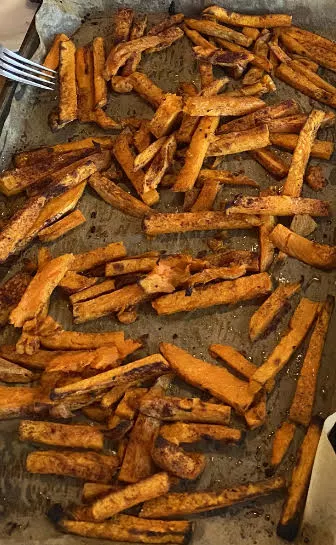

# Basic Sweet Potato Fries Recipe

A simple, tasty, and healthy carb based snack.

## Ingredients

* 1-2 Sweet Pototoes (try different types)
* Olive Oil
* Cinnamon
* Rosemary (optional)

## Directions

1. Set oven heat to 425°F (220°C).
2. Grab a pan and put a layer of parchment paper (or aluminum foil) on it.
3. Chop the potato(es) on your cutting board with a sharp knife throwing them onto the pan.
4. Drizzle the fries with olive oil. Toss the fries with clean hands to coat the fries in olive oil. Now wash your hands with soap to remove excess olive oil.
5. Top generously with cinnamon and salt. Pepper and/or rosemary may be added for additional flavor if desired.
6. Put in preheated oven. Setting timer for 20 minutes.
7. At 20 minutes, flip the fries. Rubber tongs make it easy to grab and turn a lot.
8. Return to oven setting timer for another 10-20 minutes depending on quality of the oven and desired crispiness.
9. Enjoy. Maybe them put in a glass bowl.

## Notes

* A fast method to cut the the sweet pototoes is first into fourths, slice the fourths, chops the sliced layers while stacked into fries.
* If you want to experiment with a variety of fats, consider combining the olive oil with grass-fed butter and coconut oil. I believe the issue with coconut oil is it likes being cooked at lower temperatures or else the health quality of the oil will degrade.

## Contribution

Shane Kunz - [Website](https://shanekunz.com)

;tags: potato snack side fasting
