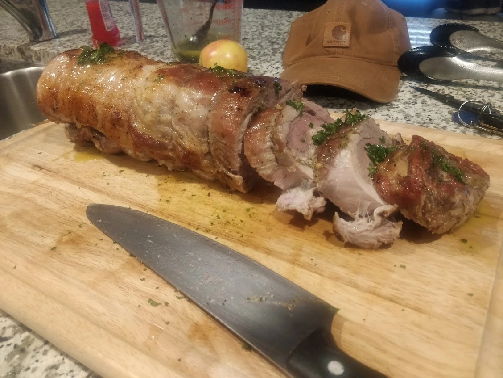

# Tuscan Style Pork Roast

An herbaceous pancetta stuffed pork roast with a crispy exterior. Finished with a lemon vinaigrette.
Adapted from [Binging With Babish](https://www.youtube.com/watch?v=AgFaljoriYA) whose instructions are notoriously bad.

- ⏲️ Prep time: 30 minutes
- 🍳 Cook time: 2 hours
- 🍽️ Servings: 6-8 people

## Equipment
- Food processor
- Fine mesh strainer
- Cast iron skillet
- Butchers twine

## Ingredients
- 1 pork Roast
- 2-3 Tbsp fresh rosemary
- 8 cloves garlic, minced
- ⅓ cup high quality olive oil
- 1 lemon
- 4 oz pancetta or bacon
- 1 tsp fresh parsley

## Directions
1.	Preheat oven to 275°F (135°C)
2.	Butterfly the roast by cutting into three parts by cutting into the side starting a third of the way up the roast. When you get to the end of the roast open it up and repeat for the remaining roast. You're opening it up like a pamphlet. Refer to the video linked above if you're confused.
2.	Cover with plastic wrap and beat with meat mallet to pound the pork to an even levelness.
3.	Mince garlic cloves(8) with the rosemary(2 Tbsp). Place into a cold pan with olive oil(⅓ cup) and zest of lemon(1). Keep lemon for later.
4.	Bring to slow simmer on medium low heat for 2-3 minutes. Strain the herbs making sure to squeeze all excess oil. Reserve oil for later.
5.	Add pancetta/bacon(4 oz) to food processor. Pulse a few times before adding the garlic/rosemary mixture. Process until a smooth paste forms.
6.	Salt and pepper both sides of the roast before placing the roast fat side down and spreading the paste over the roast leaving about a 2 inch gap on one side.
7.	Roll tightly towards the 2 inch gap and use butchers twine to secure the roll. Place a knot every inch or so.
8.	Bake at 275°F (135°C) for 2 hours or until internal temperature reads 135°F (57°C) in the thickest part.
9.	Add vegetable oil to cast iron skillet and heat on high until ripping hot. Cut remaining lemon in half. Brown all sides of pork roast and lemon using tongs.
10.	Juice the lemon into the remaining oil from the garlic/rosemary herb spread. Add freshly chopped parsley. Whisk with fork until emulsified. Season with salt and pepper.
11.	Slice roast into ½ inch thick slices and top with lemon herb vinaigrette.

##### A note on ingredient snootiness
I point out that ingredients need to be fresh, the olive oil high quality, the salt needs to be kosher, and the pepper freshly ground not because I'm some rich snob but because it actually matters. The olive oil is one of the main flavors in this dish and it will taste significantly worse if you cheap out. Herbs, especially rosemary, don't even taste the same when comparing dried to fresh.

## Contribution
- Tanner Wilcox – [gitlab](https://git.najer.info/twiclo), [donate](https://twil.cx/donate.txt)

;tags: italian pork roast
